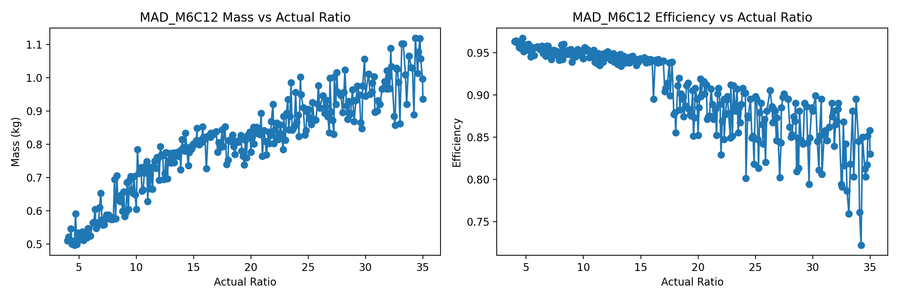
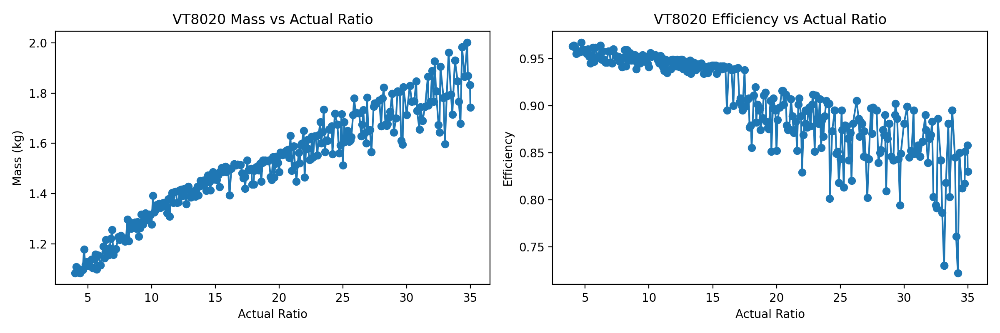
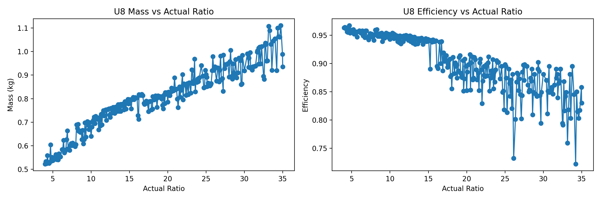
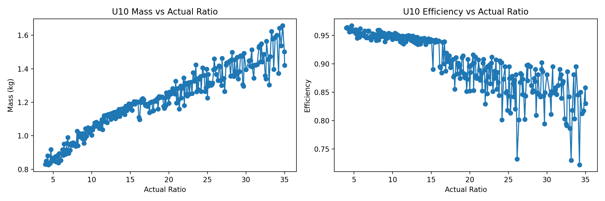
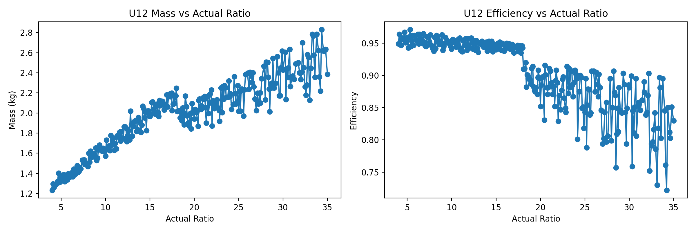

# Five-bar-monoped-optimization

## Results

Video of the paper along with simulation videos are given here. Optimised mass and efficiency plots for gear ratios 4:1 to 35:1.

## Video

[Click here to watch the video](results/videos/AIM_paper_video.mp4)

## Gearbox Optimization Results

*Figure: Optimized gearbox parameters (MAD M6C12 configuration).*

*Figure: Optimized gearbox parameters (VT8020 configuration).*

*Figure: Optimized gearbox parameters (T-Motor MN8014 configuration).*

*Figure: Optimized gearbox parameters (T-Motor U8 configuration).*

*Figure: Optimized gearbox parameters (T-Motor U10 configuration).*

*Figure: Optimized gearbox parameters (T-Motor U12 configuration).*
